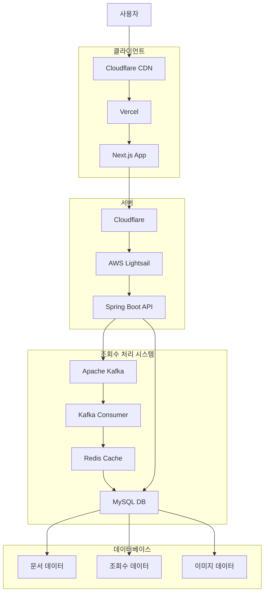

# 런너위키

## 기술 스택
- Client
  - Typescript
  - Next.js
- Server
  - Java 21
  - Springboot 3.5.4
  - MySQL 8.0.38
  - Redis 7.4
  - Kafka 3.8.0
- Other
  - Docker
  - Docker Compose
  - Meilisearch 1.15
  - Vercel
  - Cloudflare
  - AWS S3

## 시스템 아키텍처

