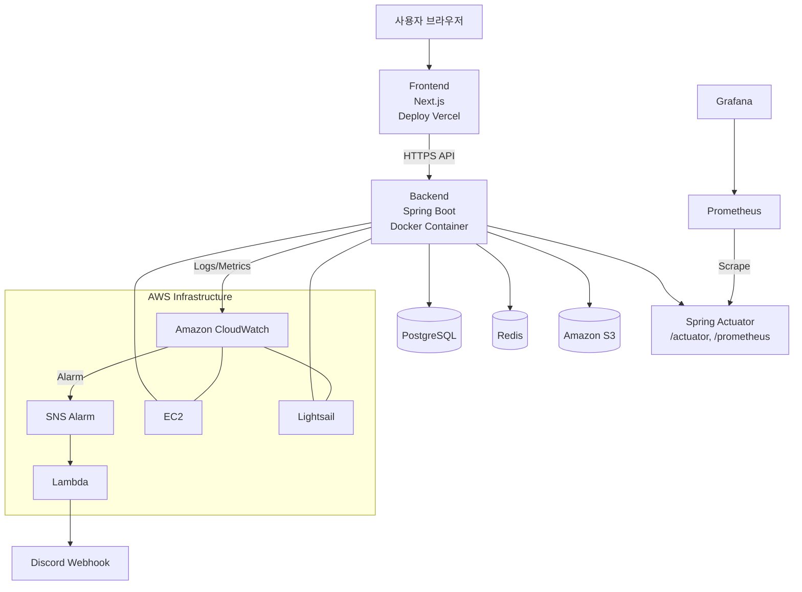
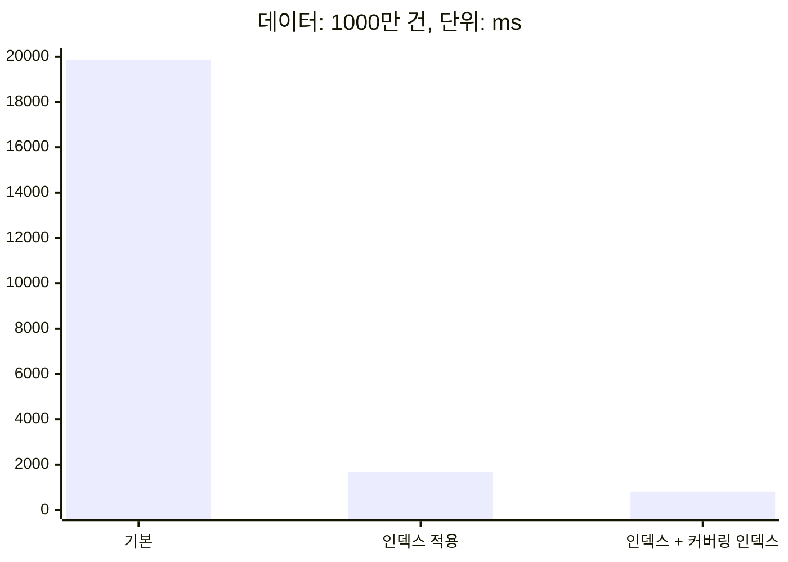
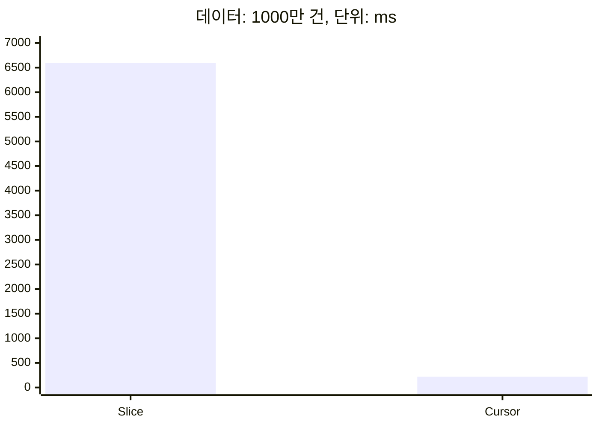

# 런너위키

## 기술

### Frontend

- TypeScript 5
- Next.js 16.1.1
- Tailwind CSS
- Vercel

### Backend

- Java 21
- Spring Boot 4.0.1
- Spring Data JPA
- Spring Actuator
- PostgreSQL
- Redis
- Flyway

### Observability / Monitoring

- Prometheus
- Grafana
- Amazon CloudWatch
- Amazon SNS
- AWS Lambda
- Discord Webhook

### Storage

- Amazon S3

### Infrastructure / Network

- Docker
- Amazon EC2
- Amazon Lightsail
- Amazon VPC
- Cloudflare Tunnel
- Cloudflare DNS / Proxy

## 아키텍처


```mermaid
flowchart TB
    U[사용자 브라우저]
    FE[Frontend<br/>Next.js<br/>Deploy Vercel]
    BE[Backend<br/>Spring Boot<br/>Docker Container]
    PG[(PostgreSQL)]
    RD[(Redis)]
    S3[(Amazon S3)]
    U --> FE
    FE -->|HTTPS API| BE
    BE --> PG
    BE --> RD
    BE --> S3
%% Monitoring & Metrics
    ACT[Spring Actuator<br/>/actuator, /prometheus]
    PROM[Prometheus]
    GRAF[Grafana]
    CW[Amazon CloudWatch]
    SNS[SNS Alarm]
    LAMBDA[Lambda]
    DISCORD[Discord Webhook]
    BE --> ACT
    PROM -->|Scrape| ACT
    GRAF --> PROM
    BE -->|Logs/Metrics| CW
    CW -->|Alarm| SNS
    SNS --> LAMBDA
    LAMBDA --> DISCORD

    subgraph AWS Infrastructure
        EC2[EC2]
        LS[Lightsail]
        CW
        SNS
        LAMBDA
    end

    BE --- EC2
    BE --- LS
    CW --- EC2
    CW --- LS
```

## 기능

### 문서(게시글) 관리

- 문서 작성/조회/수정/삭제
- 카테고리 기반 분류

### 문서 기록(히스토리)

- 문서 변경 이력 저장
- 문서 기록 목록/상세 조회
    - 특정 버전 확인

### 이미지 첨부

- AWS S3 Presigned URL 기반 직접 업로드 방식
- 임시 경로에 업로드 후 문서 저장 시 실제 경로로 이동
- Lifecycle 정책으로 미사용 이미지 자동 삭제
- 업로드 파일 타입 및 만료 시간 제한으로 보안 강화

### 조회수 및 인기 문서

- 인기 문서 TOP 랭킹 제공
- Redis 기반 중복 방지
    - 동일 IP/문서 일정 시간 내 조회수 중복 반영 방지
- Redis ZSet 기반 랭킹 관리

### 검색 기능

- 문서 제목 기반 검색 지원
- 한글 초성 검색 지원
    - 예: 제목1 → ㅈㅁ1 로도 검색 가능

- 입력값이 초성인지/일반 텍스트인지 판별해서 검색 방식 분기
    - 일반 텍스트: 제목 문자열 기준 검색
    - 초성: 제목을 초성으로 변환한 값 기준 검색

## 성능 개선

### 문서 페이지 조회

> 응답 속도 95.91% 감소 (19,872ms > 813ms)


```mermaid
xychart-beta
    title "데이터: 1000만 건, 단위: ms"
    x-axis ["기본", "인덱스 적용", "인덱스 + 커버링 인덱스"]
    y-axis 0 --> 20000
    bar [19872, 1682, 813]
```

#### 개선 전


Spring Data JPA의 `PageRequest + Sort`를 사용하여 다음과 같이 최신 문서 목록을 조회

- `ORDER BY updated_at DESC` 기반 정렬
- `OFFSET` 기반 페이징
- `Page` 생성 시 자동으로 수행되는 `COUNT` 쿼리

문제점

- 데이터가 많아질수록 `ORDER BY + OFFSET` 비용이 급격히 증가
- `COUNT(*)` 쿼리가 대용량 테이블에서 병목이 됨

#### 개선 1: 인덱스 설정


1. 정렬 + 필터에 맞춘 복합 인덱스

```sql
CREATE INDEX idx_document_active_updated_id_desc
    ON document (updated_at DESC, id DESC) WHERE is_deleted = FALSE;

CREATE INDEX idx_document_active_category_updated_id_desc
    ON document (category, updated_at DESC, id DESC) WHERE is_deleted = FALSE;
```

- 삭제되지 않은 데이터만 인덱싱
- 정렬을 인덱스로 처리
- OFFSET 조회 성능 개선

#### 개선 2: 커버링 인덱스 기법 적용


1. 전체 row를 바로 조회하지 않고, 인덱스로 커버 가능한 `id`, `updated_at`만 먼저 조회

```sql
SELECT id, updated_at
FROM document
WHERE is_deleted = FALSE
ORDER BY updated_at DESC, id DESC
LIMIT :limit OFFSET :offset;
```

- 정렬 대상 데이터 크기 감소
- 정렬 비용 절감

2. ID 기준 실제 데이터 재조회

```sql
SELECT d.*
FROM (SELECT id, updated_at
      FROM document
      WHERE is_deleted = FALSE
      ORDER BY updated_at DESC, id DESC
      LIMIT :limit OFFSET :offset) t
         JOIN document d ON d.id = t.id
ORDER BY t.updated_at DESC, t.id DESC;
```

- 1차 조회 결과를 기준으로 필요한 데이터만 다시 조인
- 대량 Full Scan 방지
- 불필요한 Row 접근 제거

3. 조회 시 전체 개수를 끝까지 세지 않고, UI에 필요한 범위까지만 카운트하도록 제한

```sql
SELECT count(*)
FROM (SELECT id
      FROM document
      WHERE is_deleted = FALSE
      LIMIT :limit) t
```

```java
public static int calculatePageLimit(
    final int page,             // 현재 페이지 번호
    final int pageSize,         // 한 페이지당 데이터 수
    final int movablePageCount  // 한 번에 보여줄 페이지 개수
) {
    return ((page / movablePageCount) + 1) * pageSize * movablePageCount + 1;
}
```

### 문서 검색 조회

> 응답 속도 96.65% 감소 (6,591ms > 221ms)


```mermaid
xychart-beta
    title "데이터: 1000만 건, 단위: ms"
    x-axis ["Slice", "Cursor"]
    y-axis 0 --> 7000
    bar [6591, 221]
```

#### 개선 전

Spring Data JPA의 `PageRequest + Sort`를 사용하여 다음과 같이 검색 데이터를 조회

```java
final Sort sort = Sort.by(Direction.DESC, "updatedAt").descending();
final PageRequest pageRequest = PageRequest.of(page, size, sort);

final Slice<Document> documentSlice = documentRepository.findAllByTitleChosung_ValueStartingWith(
    keyword,
    pageRequest
);
```

문제점

- Offset 증가에 따른 성능 저하
- 대용량 데이터에서 성능이 악화

#### 개선: Cursor 기반으로 조회

마지막으로 조회한 기준값`cursorId`을 이용해 다음 페이지를 조회

```sql
SELECT d.*
FROM (SELECT id
      FROM document
      WHERE is_deleted = FALSE
        AND LOWER(title_chosung) LIKE LOWER(CONCAT(:keyword, '%'))
        AND (
          :cursorId IS NULL
              OR id < :cursorId
          )
      ORDER BY id DESC
      LIMIT :limit) t
         JOIN document d ON d.id = t.id
ORDER BY t.id DESC
```

- Index Range Scan으로 효율적인 다음 페이지 조회
- 페이지 깊이에 영향 없는 일정한 성능

## 트러블 슈팅

### 1. 게시글 작성 동시성 문제

#### 문제

- 동일한 카테고리에 동일한 제목으로 게시글 생성 요청이 동시에 여러 번 들어올 경우, 중복된 게시글이 생성되는 문제가 발생

#### 원인

- 애플리케이션 레벨에서만 중복 체크 수행
- 동시 요청 상황에서 트랜잭션 경합 발생
- Race Condition으로 인해 중복 데이터 저장 가능

#### 해결

- DB 레벨에서 **유니크 제약 조건(UNIQUE INDEX)** 추가
- 애플리케이션 로직은 단순화하고, 무결성은 DB가 보장하도록 설계
- 중복 생성 시 DB 예외를 캐치하여 실패 처리

> 동시성 문제는 코드보다 **DB 제약 조건으로 해결하는 것이 가장 안정적**이라는 점을 경험

### 2. 게시글 수정 동시성 문제

#### 문제

- 게시글 수정 요청이 동시에 여러 번 들어올 경우, 게시글 버전이 중복돼서 생성되는 문제가 발생

#### 원인

- 동시 요청 상황에서 트랜잭션 경합 발생
- Race Condition으로 인해 중복 데이터 저장 가능

#### 해결

- DB 레벨에서 **유니크 제약 조건(UNIQUE INDEX)** 추가
- 비관적 락 도입
- 중복 생성 시 DB 예외를 캐치하여 실패 처리

### 3. 이미지 업로드 병목 문제

#### 문제

- 기존에는 서버가 이미지를 직접 받아서 S3로 업로드하는 방식이었는데, 트래픽이 늘어날수록 문제가 발생
    - 이미지 업로드 요청이 몰리면 서버 CPU/메모리/네트워크가 업로드 트래픽을 그대로 감당
    - 업로드 중간에 타임아웃/끊김이 생기면 서버 리소스만 낭비
    - `글 작성 취소` 같은 케이스에서 불필요한 업로드 처리 기능까지 작성

#### 원인

- 업로드 경로가 `Client → Server → S3` 로 구성되어 서버가 파일 전송 중계자 역할을 함
- 업로드는 데이터가 크고 시간이 길어 서버 자원 점유 시간이 길어짐
- 서버가 업로드/검증/저장까지 전부 담당해 업무가 과도하게 집중

#### 해결

- 업로드 흐름을 `Client → S3` 로 바꾸고, 서버는 `업로드 권한(서명된 URL)`만 발급하도록 분리
    - 서버는 Presigned URL 발급 API만 제공 (짧은 만료시간 + 업로드 정책)
    - 클라이언트는 발급받은 URL로 S3에 직접 PUT 업로드
    - 업로드 성공 후, 클라이언트가 서버에 최종 게시글 저장 요청
    - 서버는 `어떤 이미지가 실제로 게시글에 사용됐는지`만 관리하고, 업로드 트래픽에서 빠짐

### 4. 개발/운영 서버 간 테이블 제약 조건 불일치 문제

#### 문제

- 개발 서버에서는 정상 동작하던 기능이 운영 서버에서는 제약 조건 오류로 인해 실패
- 환경별로 테이블 스키마 상태가 달라 유지보수가 어려움

#### 원인

- SQL 스키마를 수동으로 관리
- 개발/운영 서버 간 스키마 동기화 실패

#### 해결

- **Flyway** 도입
- 모든 테이블 변경 사항을 마이그레이션 파일로 관리
- 서버 환경과 무관하게 동일한 스키마 상태 유지

> 스키마 관리는 수동이 아닌 **마이그레이션 도구로 관리해야 한다는 중요성**을 체감

### 3. EC2/RDS 장애 발생 시 원인 파악 어려움

#### 문제

- 서비스 장애 발생 시 EC2 문제인지, RDS 문제인지 즉시 파악이 어려움
- 장애 인지가 늦어 대응이 지연됨

#### 원인

- 서버 리소스 모니터링 부재
- 장애 알림 시스템 미구성

#### 해결


- **CloudWatch**를 이용한 EC2/RDS 메트릭 모니터링
- 임계치 초과 시 **SNS**로 이벤트 발행
- **Lambda**를 통해 Discord Webhook 연동
- 장애 발생 시 Discord로 실시간 알림 수신

> 장애는 발생 자체보다 **인지하지 못하는 상황이 더 위험**하다는 것을 경험
