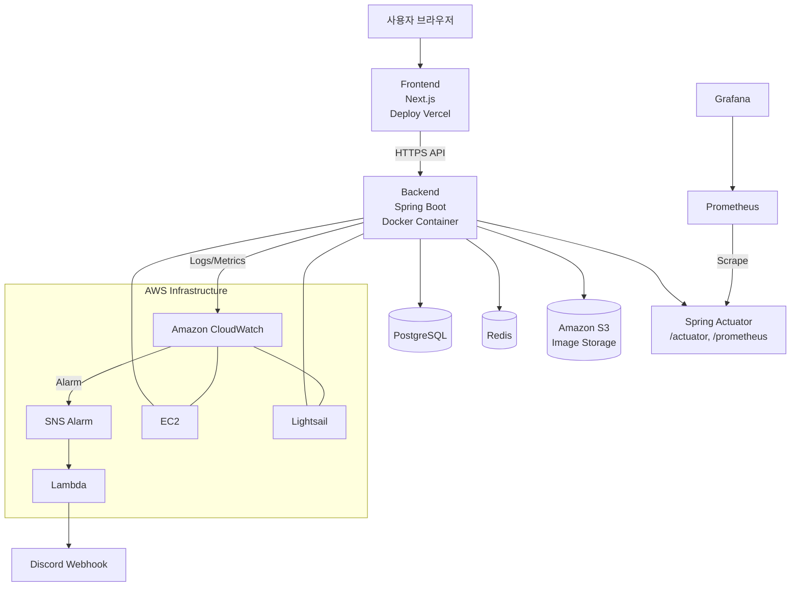
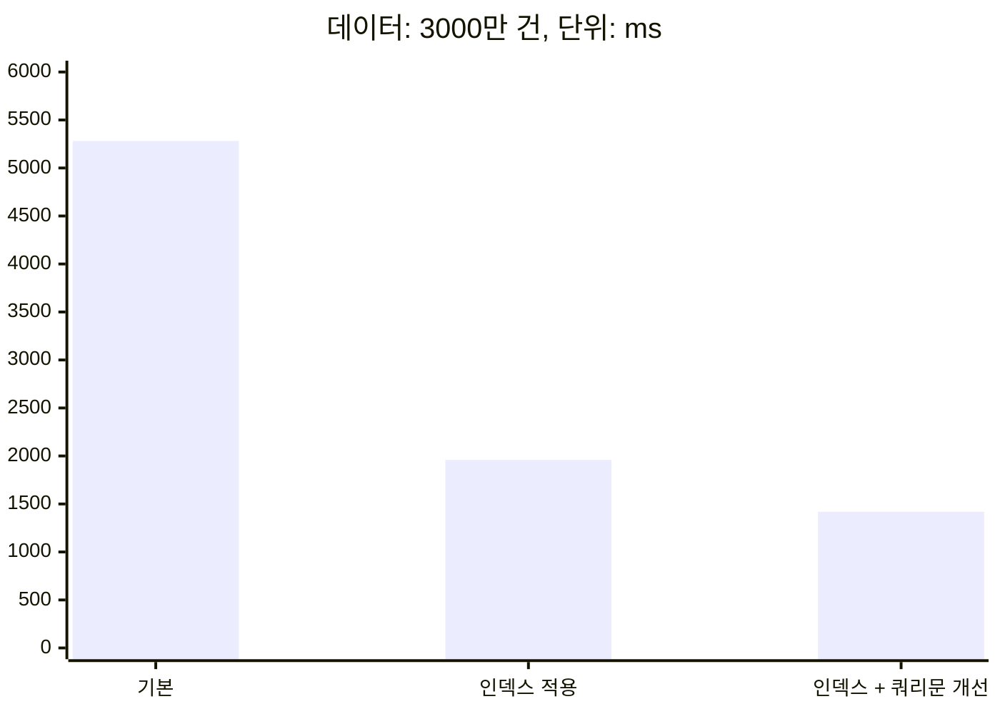
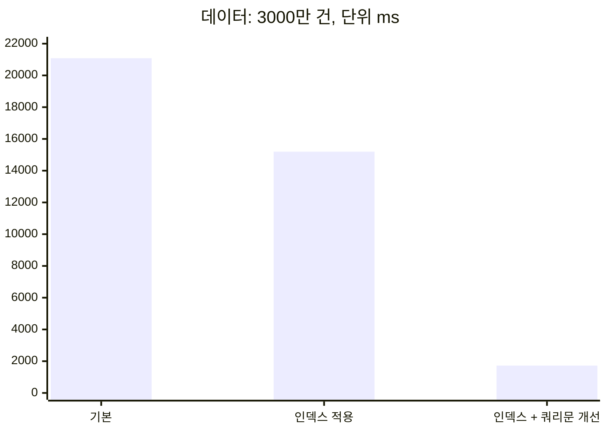

# 런너위키

## 기술

### Frontend

- TypeScript 5
- Next.js 16.1.1
- Tailwind CSS
- Vercel

### Backend

- Java 21
- Spring Boot 4.0.1
- Spring Data JPA
- Spring Actuator
- PostgreSQL
- Redis
- Flyway

### Observability / Monitoring

- Prometheus
- Grafana
- Amazon CloudWatch
- Amazon SNS
- AWS Lambda
- Discord Webhook

### Storage

- Amazon S3

### Infrastructure / Network

- Docker
- Amazon EC2
- Amazon Lightsail
- Amazon VPC
- Cloudflare Tunnel
- Cloudflare DNS / Proxy

## 아키텍처


```mermaid
flowchart TB
    U[사용자 브라우저]
    FE[Frontend<br/>Next.js<br/>Deploy Vercel]
    BE[Backend<br/>Spring Boot<br/>Docker Container]
    PG[(PostgreSQL)]
    RD[(Redis)]
    S3[(Amazon S3<br/>Image Storage)]
    U --> FE
    FE -->|HTTPS API| BE
    BE --> PG
    BE --> RD
    BE --> S3
%% Monitoring & Metrics
    ACT[Spring Actuator<br/>/actuator, /prometheus]
    PROM[Prometheus]
    GRAF[Grafana]
    CW[Amazon CloudWatch]
    SNS[SNS Alarm]
    LAMBDA[Lambda]
    DISCORD[Discord Webhook]
    BE --> ACT
    PROM -->|Scrape| ACT
    GRAF --> PROM
    BE -->|Logs/Metrics| CW
    CW -->|Alarm| SNS
    SNS --> LAMBDA
    LAMBDA --> DISCORD

    subgraph AWS Infrastructure
        EC2[EC2]
        LS[Lightsail]
        CW
        SNS
        LAMBDA
    end

    BE --- EC2
    BE --- LS
    CW --- EC2
    CW --- LS
```

## 기능

### 문서(게시글) 관리

- 문서 작성/조회/수정/삭제
- 카테고리 기반 분류

### 문서 기록(히스토리)

- 문서 변경 이력 저장
- 문서 기록 목록/상세 조회
    - 특정 버전 확인

### 이미지 첨부

- 문서에 이미지 업로드/연결
- 이미지 상태 관리(임시/만료 등) 및 정리 로직

### 조회수 및 인기 문서

- 인기 문서 TOP 랭킹 제공
- Redis 기반 중복 방지
    - 동일 IP/문서 일정 시간 내 조회수 중복 반영 방지
- Redis ZSet 기반 랭킹 관리

### 검색 기능

- 문서 제목 기반 검색 지원
- 한글 초성 검색 지원
    - 예: 제목1 → ㅈㅁ1 로도 검색 가능

- 입력값이 초성인지/일반 텍스트인지 판별해서 검색 방식 분기
    - 일반 텍스트: 제목 문자열 기준 검색
    - 초성: 제목을 초성으로 변환한 값 기준 검색

- PostgreSQL 기능 활용
    - GENERATED COLUMN으로 정규화 컬럼 생성
    - `pg_trgm` 확장으로 유사도 검색 처리

## 성능 개선

### 문서 페이지 조회

> 응답 속도 73.13% 감소 (5,281ms > 1,419ms)


```mermaid
xychart-beta
    title "데이터: 3000만 건, 단위: ms"
    x-axis ["기본", "인덱스 적용", "인덱스 + 쿼리문 개선"]
    y-axis 0 --> 6000
    bar [5281, 1959, 1419]
```

#### 개선 전

Spring Data JPA의 `PageRequest + Sort`를 사용하여 다음과 같이 최신 문서 목록을 조회

- `ORDER BY updated_at DESC` 기반 정렬
- `OFFSET` 기반 페이징
- `Page` 생성 시 자동으로 수행되는 `COUNT` 쿼리

문제점

- 데이터가 많아질수록 `ORDER BY + OFFSET` 비용이 급격히 증가
- `COUNT(*)` 쿼리가 대용량 테이블에서 병목이 됨

#### 개선 1: 쿼리 구조 변경 (ID 선조회 + JOIN)

1. 인덱스를 타고 `id`만 최신순으로 페이징
2. 해당 `id` 목록을 기준으로 실제 row를 다시 조인

```sql
SELECT d.*
FROM (SELECT id
      FROM document
      WHERE deleted_at IS NULL
      ORDER BY updated_at DESC LIMIT :limit
      OFFSET :offset) t
         LEFT JOIN document d ON t.id = d.id
WHERE d.deleted_at IS NULL;
```

- 정렬 비용을 `전체 row`가 아니라 `id 컬럼` 수준으로 축소
- 테이블 접근 횟수를 `페이지 크기`만큼으로 제한

#### 개선 2: COUNT 쿼리 제한

조회 시 전체 개수를 끝까지 세지 않고, UI에 필요한 범위까지만 카운트하도록 제한

```java
Long totalElements = documentHistoryRepository.countByDocumentId(
        documentId,
        PageLimitCalculator.calculatePageLimit(page, size, 10)
);
```

### 문서 기록 페이지 조회

> 응답 속도 91.84% 감소 (21,085ms > 1,721ms)


```mermaid
xychart-beta
    title "데이터: 3000만 건, 단위 ms"
    x-axis ["기본", "인덱스 적용", "인덱스 + 쿼리문 개선"]
    y-axis 0 --> 22000
    bar [21085, 15197, 1721]
```

#### 개선 전

Spring Data JPA의 `PageRequest + Sort` 기반으로 문서 기록(DocumentHistory)을 조회

- `ORDER BY version DESC` 기반 정렬
- `OFFSET` 기반 페이징
- `Page` 생성 시 자동으로 수행되는 `COUNT` 쿼리

문제점

- 문서 기록 데이터는 계속 누적되기 때문에 `ORDER BY + OFFSET` 비용이 시간이 갈수록 증가
- `COUNT(*)` 쿼리가 대용량 문서 기록 테이블에서 병목이 될 가능성이 큼

#### 개선 1: 쿼리 구조 변경 (ID 선조회 + JOIN)

1. `document_id` + `deleted_at IS NULL` 조건으로 범위를 먼저 좁힘
2. 인덱스를 타고 `id`만 `version DESC` 기준으로 페이징
3. 해당 `id` 목록을 기준으로 실제 row를 다시 조인

```sql
SELECT dh.*
FROM (SELECT id
      FROM document_history
      WHERE document_id = :documentId
        AND deleted_at IS NULL
      ORDER BY version DESC LIMIT :limit
      OFFSET :offset) t
         JOIN document_history dh
              ON dh.id = t.id
WHERE dh.deleted_at IS NULL;
```

- 정렬 비용을 `전체 row`가 아니라 `id 컬럼` 수준으로 축소
- 조인으로 가져오는 row 수를 `페이지 크기`로 제한
- `document_id` 조건으로 탐색 범위를 빠르게 축소

#### 개선 2: COUNT 쿼리 제한

조회 시 전체 문서 기록 개수를 끝까지 세지 않고, UI에 필요한 범위까지만 카운트하도록 제한

```sql
SELECT count(*)
FROM (SELECT id
      FROM document_history
      WHERE document_id = :documentId
        AND deleted_at IS NULL
      ORDER BY version DESC LIMIT :limit) t;
```

- 정확한 전체 건수 대신 `필요한 범위까지만` 계산
- 대용량 테이블에서 `COUNT(*)`로 인한 전체 스캔 방지

## 트러블 슈팅

### 1. 게시글 작성 동시성 문제

#### 문제

동일한 카테고리에 동일한 제목으로 게시글 생성 요청이 동시에 여러 번 들어올 경우, 중복된 게시글이 생성되는 문제가 발생

#### 원인

- 애플리케이션 레벨에서만 중복 체크 수행
- 동시 요청 상황에서 트랜잭션 경합 발생
- Race Condition으로 인해 중복 데이터 저장 가능

#### 해결

- DB 레벨에서 **유니크 제약 조건(UNIQUE INDEX)** 추가
- 애플리케이션 로직은 단순화하고, 무결성은 DB가 보장하도록 설계
- 중복 생성 시 DB 예외를 캐치하여 실패 처리

> 동시성 문제는 코드보다 **DB 제약 조건으로 해결하는 것이 가장 안정적**이라는 점을 경험

### 2. 개발/운영 서버 간 테이블 제약 조건 불일치 문제

#### 문제

- 개발 서버에서는 정상 동작하던 기능이 운영 서버에서는 제약 조건 오류로 인해 실패
- 환경별로 테이블 스키마 상태가 달라 유지보수가 어려움

#### 원인

- SQL 스키마를 수동으로 관리
- 개발/운영 서버 간 스키마 동기화 실패

#### 해결

- **Flyway** 도입
- 모든 테이블 변경 사항을 마이그레이션 파일로 관리
- 서버 환경과 무관하게 동일한 스키마 상태 유지

> 스키마 관리는 수동이 아닌 **마이그레이션 도구로 관리해야 한다는 중요성**을 체감

### 3. EC2/RDS 장애 발생 시 원인 파악 어려움

#### 문제

- 서비스 장애 발생 시 EC2 문제인지, RDS 문제인지 즉시 파악이 어려움
- 장애 인지가 늦어 대응이 지연됨

#### 원인

- 서버 리소스 모니터링 부재
- 장애 알림 시스템 미구성

#### 해결


- **CloudWatch**를 이용한 EC2/RDS 메트릭 모니터링
- 임계치 초과 시 **SNS**로 이벤트 발행
- **Lambda**를 통해 Discord Webhook 연동
- 장애 발생 시 Discord로 실시간 알림 수신

> 장애는 발생 자체보다 **인지하지 못하는 상황이 더 위험**하다는 것을 경험
