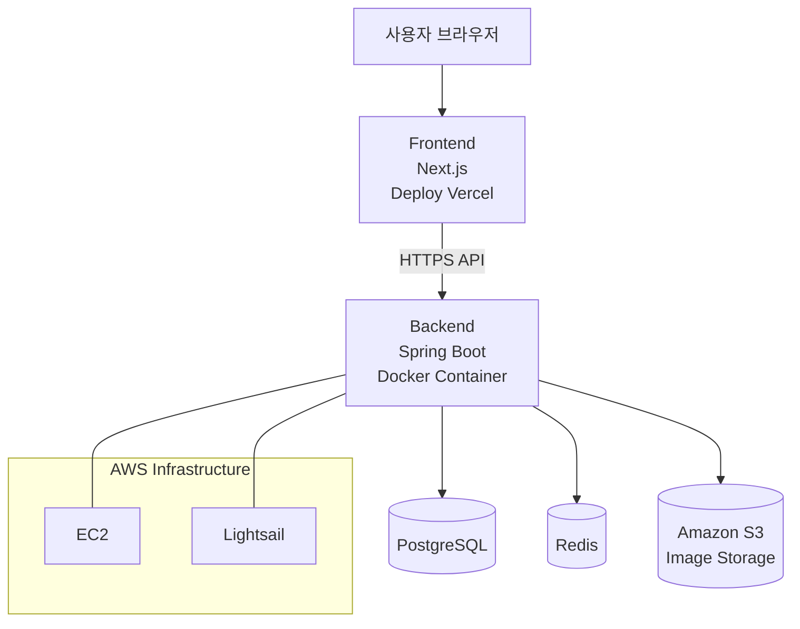
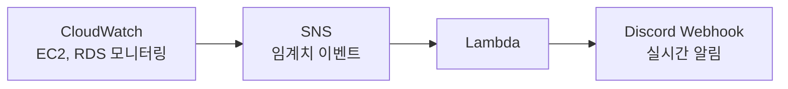

# 런너위키

## 기술

### Frontend

- TypeScript 5
- Next.js 16.1.1
- Vercel

### Backend

- Java 21
- Spring Boot 4.0.1
- PostgreSQL
- Redis
- Flyway

### Storage

- Amazon S3

### Infrastructure

- Docker
- Amazon EC2
- Amazon Lightsail

## 아키텍처

```mermaid
flowchart TB
  U[사용자 브라우저]
  FE[Frontend<br/>Next.js<br/>Deploy Vercel]
  BE[Backend<br/>Spring Boot<br/>Docker Container]

  PG[(PostgreSQL)]
  RD[(Redis)]
  S3[(Amazon S3<br/>Image Storage)]

  U --> FE
  FE -->|HTTPS API| BE

  BE --> PG
  BE --> RD
  BE --> S3

  subgraph AWS Infrastructure
    EC2[EC2]
    LS[Lightsail]
  end

  BE --- EC2
  BE --- LS

```

```mermaid

flowchart LR
  CW[CloudWatch<br/>EC2, RDS 모니터링]
  SNS[SNS<br/>임계치 이벤트]
  L[Lambda]
  D[Discord Webhook<br/>실시간 알림]

  CW --> SNS
  SNS --> L
  L --> D
  
```

## 기능

### 문서(게시글) 관리

- 문서 작성/조회/수정/삭제
- 카테고리 기반 분류

### 문서 기록(히스토리)

- 문서 변경 이력 저장
- 문서 기록 목록/상세 조회
  - 특정 버전 확인

### 이미지 첨부

- 문서에 이미지 업로드/연결
- 이미지 상태 관리(임시/만료 등) 및 정리 로직

### 조회수 및 인기 문서

- 인기 문서 TOP 랭킹 제공
- Redis 기반 중복 방지
  - 동일 IP/문서 일정 시간 내 조회수 중복 반영 방지
- Redis ZSet 기반 랭킹 관리

## 트러블 슈팅

### 1. 게시글 작성 동시성 문제

#### 문제

동일한 카테고리에 동일한 제목으로 게시글 생성 요청이 동시에 여러 번 들어올 경우, 중복된 게시글이 생성되는 문제가 발생

#### 원인

- 애플리케이션 레벨에서만 중복 체크 수행
- 동시 요청 상황에서 트랜잭션 경합 발생
- Race Condition으로 인해 중복 데이터 저장 가능

#### 해결

- DB 레벨에서 **유니크 제약 조건(UNIQUE INDEX)** 추가
- 애플리케이션 로직은 단순화하고, 무결성은 DB가 보장하도록 설계
- 중복 생성 시 DB 예외를 캐치하여 실패 처리

> 동시성 문제는 코드보다 **DB 제약 조건으로 해결하는 것이 가장 안정적**이라는 점을 경험

### 2. 개발/운영 서버 간 테이블 제약 조건 불일치 문제

#### 문제

- 개발 서버에서는 정상 동작하던 기능이 운영 서버에서는 제약 조건 오류로 인해 실패
- 환경별로 테이블 스키마 상태가 달라 유지보수가 어려움

#### 원인

- SQL 스키마를 수동으로 관리
- 개발/운영 서버 간 스키마 동기화 실패

#### 해결

- **Flyway** 도입
- 모든 테이블 변경 사항을 마이그레이션 파일로 관리
- 서버 환경과 무관하게 동일한 스키마 상태 유지

> 스키마 관리는 수동이 아닌 **마이그레이션 도구로 관리해야 한다는 중요성**을 체감

### 3. EC2/RDS 장애 발생 시 원인 파악 어려움

#### 문제

- 서비스 장애 발생 시 EC2 문제인지, RDS 문제인지 즉시 파악이 어려움
- 장애 인지가 늦어 대응이 지연됨

#### 원인

- 서버 리소스 모니터링 부재
- 장애 알림 시스템 미구성

#### 해결

- **CloudWatch**를 이용한 EC2/RDS 메트릭 모니터링
- 임계치 초과 시 **SNS**로 이벤트 발행
- **Lambda**를 통해 Discord Webhook 연동
- 장애 발생 시 Discord로 실시간 알림 수신

> 장애는 발생 자체보다 **인지하지 못하는 상황이 더 위험**하다는 것을 경험
